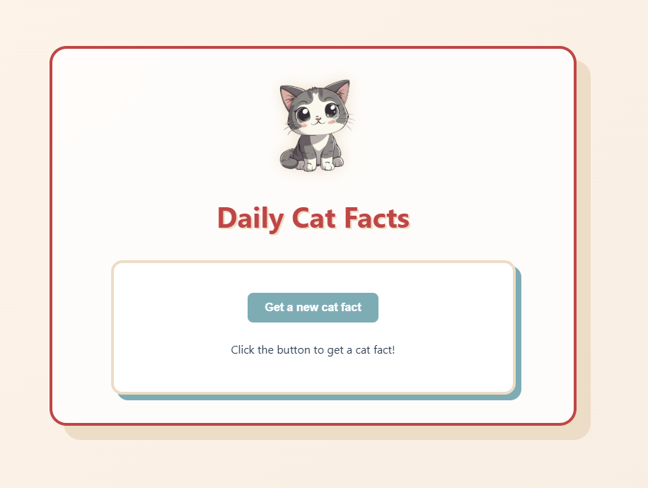
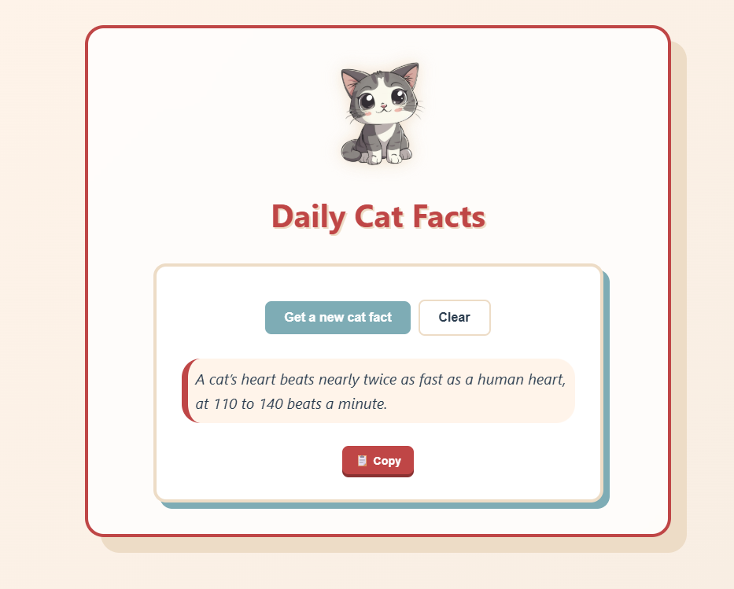

# React + TypeScript + Vite

🐾 Cat Fact Daily:

A vibrant, type-safe React application that delivers random cat facts using the CatFact Ninja API. Built with a focus on clean UI/UX and modern React patterns.

📸 Preview

|                         Home Screen                          |                         Active Fact                          |
| :----------------------------------------------------------: | :----------------------------------------------------------: |
|  |  |

✨ Features:

- Real-time Fetching: Pulls random facts from the `catfact.ninja` API.
- Copy to Clipboard: One-click functionality to share your favorite facts.
- Interactive UI: Smooth transitions, loading states, and a custom "Restart" feature.
- Toast Notifications: Built-in feedback using `react-hot-toast` for actions like copying and error handling.
- Responsive Design\*\*: A "Neo-Brutalist" aesthetic with a vibrant color palette (Teal, Terracotta, and Sand).

🛠️ Tech Stack:

- Framework: [React](https://react.dev/) (Vite)
- Language: [TypeScript](https://www.typescriptlang.org/) (for type safety and better DX)
- Styling: Pure CSS3 with Custom Variables
- Library: `react-hot-toast` for notifications

🚀 Getting Started:

- Prerequisites:

* Node.js (v18 or higher recommended)
* npm or yarn

- Installation:

1.  Clone the repository:

    ```bash
    git clone [https://github.com/Anuska86/cat-fact.git](https://github.com/Anuska86/cat-fact.git)
    ```

2.  Navigate to the project folder:

    ```bash
    cd cat-fact
    ```

3.  Install dependencies:

    ```bash
    npm install
    ```

4.  Run the development server:

    ```bash
    npm run dev
    ```

5.  View in browser:
    Open [http://localhost:5173](http://localhost:5173) to see the app.

🧠 Key Concepts Implemented:

- Asynchronous Logic: Using `async/await` with `try/catch/finally` blocks to handle API lifecycles.
- State Management: Utilizing `useState` to track data, loading status, and user interactions.
- Conditional Rendering: Dynamically showing/hiding UI elements (like the Copy and Clear buttons) based on the application state.
- Component Architecture: Clean separation of types, styles, and logic.

Developed by Ana Sappia Rey:

[](https://www.linkedin.com/in/ana-sappia-rey/)
[](https://github.com/Anuska86)
[](https://cat-fact-six.vercel.app/)

